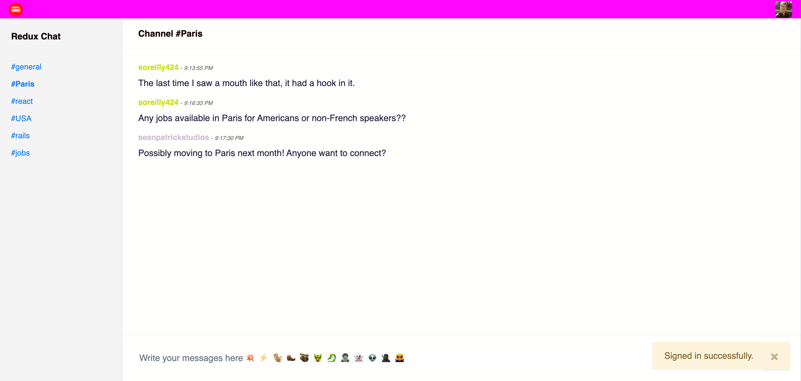

Rails app generated with [lewagon/rails-templates](https://github.com/lewagon/rails-templates), created by the [Le Wagon coding bootcamp](https://www.lewagon.com) team.

# [React Redux Rails Chat App](https://github.com/seano424/chat-rails-redux)

Source code of my personal website & blog ✨

Check the live version [here](https://github.com/seano424/chat-rails-redux) ⚡️



## 📦 Made with

- PostgreSQL DB
- Bootstrap Styles
- Redux state control
- Rails backend 
- React icons
- Action Cable

## 💻 Getting Started

Make sure you have the latest `rails` installed, on a Ruby 2.4+ environment:

  rbenv versions # Do you have 2.4+?
  gem install rails
  rails -v # Do you have 5.1+?

Install dependencies:

```bash
npm install
# or
yarn
```

Then, run the development server:

```bash
npm run dev
# or
yarn dev
```

Seed:

Create a `db/seeds.rb` file which:

1. Destroy messages, users and channels (in that order)
2. Create some channels (general, paris, react for instance)
3. Create some users (needs email / password)
4. Create some messages in several channels.

Then run it:

  rails db:migrate

Open [http://localhost:3000](http://localhost:3000) with your browser to see the result.